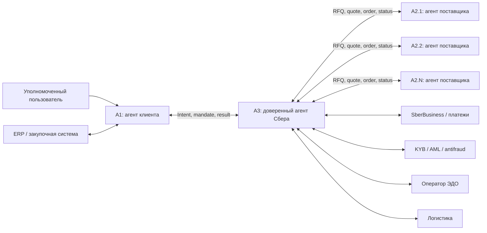
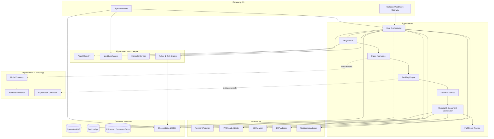
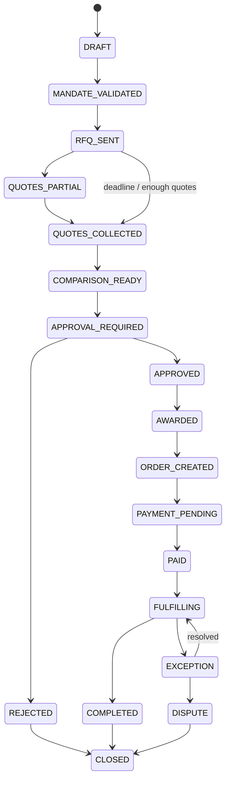
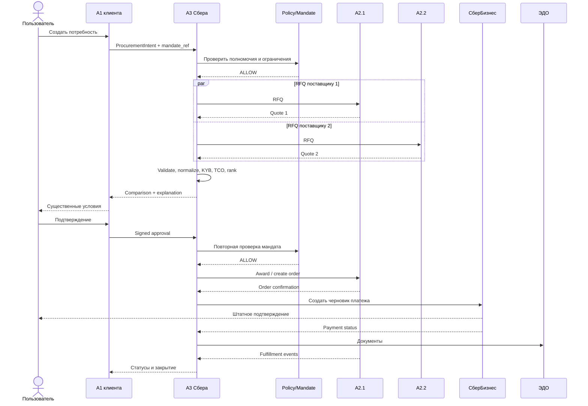

# Архитектура Sber A2A Procurement Platform

## 1. Архитектурная цель

Создать доверенный контур, в котором агент Сбера A3 безопасно оркестрирует сделки между агентом клиента A1 и несколькими агентами поставщиков A2, не раскрывая участникам лишние данные и не передавая генеративной модели полномочия на критические банковские действия.

Архитектура должна поддерживать один вертикальный MVP, но не связывать платформенное ядро с конкретной товарной категорией.

## 2. Контекст



Основной маршрут ответа: `A2 → A3 → A1`. Прямой канал `A1 ↔ A2` в MVP отсутствует. После заключения сделки он может появиться как ограниченный scoped-channel, но A3 продолжает получать события и вести аудит.

## 3. Архитектурные принципы

1. A3 — доверенный control plane и transaction coordinator, а не чат-бот.
2. A2A отвечает за взаимодействие агентов; банковские бизнес-сущности задаются версионируемым профилем.
3. Policy engine отделён от LLM.
4. Каждое действие имеет actor, mandate, purpose, correlation ID и evidence.
5. Внешние вызовы считаются ненадёжными и потенциально повторяемыми.
6. Оферты поставщиков изолированы друг от друга.
7. Ранжирование воспроизводимо и основано на правилах клиента.
8. MVP разворачивается как модульный монолит с асинхронными worker-процессами.
9. Интеграции подключаются через anti-corruption adapters.
10. Все контракты версионируются и проверяются contract tests.

## 4. Логическая архитектура A3



## 5. Назначение компонентов

### Agent Gateway

- принимает A2A/HTTP-запросы;
- завершает mTLS;
- проверяет токен и подпись;
- ограничивает частоту;
- валидирует размер и схему сообщения;
- назначает correlation ID;
- не содержит бизнес-логику сделки.

### Agent Registry

Хранит:

- идентификатор агента и владельца-ЮЛ;
- Agent Card;
- capabilities;
- endpoint и поддерживаемые версии;
- ключи/сертификаты;
- статус аттестации;
- разрешённые категории и среды;
- дату последней проверки;
- статус active/suspended/revoked.

В MVP реестр закрытый. Self-registration отсутствует.

### Identity & Access

- связывает пользователя, ЮЛ, A1/A2/A3 и service account;
- реализует RBAC/ABAC;
- проверяет audience, scopes и tenant;
- требует step-up для значимых действий.

### Mandate Service

Мандат содержит:

- `mandate_id`;
- доверителя и исполнителя;
- разрешённые операции;
- товарные категории;
- лимит одной операции и совокупный лимит;
- допустимых поставщиков;
- срок действия;
- критерии ранжирования;
- действия, требующие подтверждения;
- условия отзыва.

Проверка мандата выполняется не только на входе, но и перед `approve`, `award`, `order` и `payment`.

### Policy & Risk Engine

Возвращает одно из решений:

- `ALLOW`;
- `REQUIRE_APPROVAL`;
- `DENY`;
- `ESCALATE`.

Критические правила детерминированы и версионируются. Входы и выходы записываются в Deal Ledger.

### Deal Orchestrator

- владеет state machine;
- управляет долгоживущими задачами;
- запускает параллельные обращения к A2;
- обрабатывает timeout/retry/cancel;
- выполняет компенсационные действия;
- не хранит состояние только в памяти процесса.

### RFQ Broker

- выбирает A2 по capability и allowlist;
- формирует одинаковое коммерческое ядро RFQ;
- удаляет бюджет и закрытые данные, если их раскрытие не разрешено;
- отправляет запросы параллельно;
- принимает частичные результаты;
- закрывает окно сбора оферт по deadline.

### Quote Normalizer

- проверяет JSON Schema;
- нормализует валюту, НДС, единицы и сроки;
- проверяет TTL оферты;
- связывает позиции с каноническим SKU;
- помечает неизвестные или несопоставимые атрибуты;
- не «додумывает» отсутствующие критические характеристики.

LLM может предложить mapping свободного текста, но результат должен иметь confidence, provenance и подтверждение правилом или человеком.

### Ranking Engine

Пример вычисления:

```text
score =
    price_score        × weight.price +
    delivery_score     × weight.delivery +
    warranty_score     × weight.warranty +
    supplier_risk      × weight.risk +
    payment_terms      × weight.payment
```

Ranking Engine:

- использует веса из мандата;
- учитывает hard constraints до расчёта score;
- считает TCO, а не только цену;
- сохраняет входы и версию алгоритма;
- раскрывает комиссию Сбера;
- не меняет веса в активной сделке без нового подтверждения.

### Approval Service

- формирует снимок существенных условий;
- вычисляет hash snapshot;
- показывает пользователю причину подтверждения;
- проверяет полномочия;
- получает подтверждение штатным механизмом;
- не принимает подтверждение из неподписанного ответа LLM.

### Deal Ledger

Append-only журнал:

- события сделки;
- отправленные и принятые сообщения;
- hash payload и документов;
- actor и mandate;
- решения policy engine;
- версии схем, правил и моделей;
- подтверждения;
- ошибки, retry и compensation;
- ссылки на платёж и ЭДО.

Ledger не обязан быть блокчейном. Для MVP достаточно append-only модели, контроля целостности, резервного копирования и разграничения доступа.

### Model Gateway

Едиственная точка вызова моделей:

- allowlist моделей;
- шаблоны prompts;
- redaction;
- лимиты;
- журналирование метаданных;
- запрет передачи секретов и лишних данных;
- оценка качества;
- возможность отключить AI без остановки детерминированного процесса.

## 6. Протокол взаимодействия

### Базовый уровень

Используется A2A как модель:

- Agent Card и discovery;
- Task lifecycle;
- Message;
- Artifact;
- async callbacks/streaming;
- объявление схем аутентификации.

Для MVP допустим HTTP/REST binding с JSON и callbacks, если он соответствует согласованному A2A-профилю.

MCP не используется как межкорпоративный transaction protocol. Он может применяться внутри A1/A2/A3 для подключения инструментов агента к ERP, каталогу или поиску.

### Банковский A2A-профиль

Платформа определяет расширения:

- `sber.procurement.intent.v1`;
- `sber.procurement.rfq.v1`;
- `sber.procurement.quote.v1`;
- `sber.procurement.comparison.v1`;
- `sber.procurement.approval.v1`;
- `sber.procurement.award.v1`;
- `sber.procurement.order.v1`;
- `sber.procurement.fulfillment.v1`;
- `sber.evidence.record.v1`.

Каждое сообщение включает:

```json
{
  "message_id": "uuid",
  "correlation_id": "uuid",
  "causation_id": "uuid-or-null",
  "schema": "sber.procurement.rfq.v1",
  "sender_agent_id": "agent-a3",
  "recipient_agent_id": "agent-a2-001",
  "mandate_ref": "mandate-123",
  "purpose": "PROCUREMENT_QUOTE",
  "created_at": "RFC-3339",
  "expires_at": "RFC-3339",
  "idempotency_key": "stable-business-key",
  "payload": {},
  "signature": {}
}
```

Секреты, access token и полные документы не помещаются в payload. Передаются короткоживущие ссылки с ограниченным audience.

## 7. Каноническая доменная модель

| Сущность | Назначение |
|---|---|
| `ProcurementIntent` | Потребность, ограничения и критерии покупателя |
| `Mandate` | Полномочия A1/A3 и правила подтверждения |
| `RFQ` | Одинаковый запрос поставщикам |
| `Quote` | Подписанное предложение A2 с TTL |
| `QuoteLine` | Позиция с ценой, количеством и характеристиками |
| `Comparison` | Нормализованные варианты, TCO и объяснение |
| `ApprovalSnapshot` | Неизменяемые условия, показанные пользователю |
| `Award` | Выбор поставщика после подтверждения |
| `Order` | Заказ поставщику |
| `PaymentIntent` | Намерение оплаты, не сам платёж |
| `DocumentRef` | Ссылка, hash и тип документа |
| `FulfillmentEvent` | Статус исполнения |
| `EvidenceRecord` | Кто, что, почему и по какому мандату сделал |

Деньги хранятся в minor units или decimal с явной валютой. Floating point запрещён.

## 8. State machine сделки



Каждый переход:

- проверяет ожидаемое текущее состояние;
- проверяет мандат и policy;
- записывает событие;
- использует optimistic locking;
- создаёт внешние команды через transactional outbox.

## 9. Последовательность основного сценария



## 10. Надёжность

### Идемпотентность

- каждый command имеет `idempotency_key`;
- повторный `Award` возвращает исходный результат;
- уникальный ключ заказа связывает `deal_id + selected_quote_id`;
- payment adapter не создаёт второй платёж при повторе.

### Доставка сообщений

Предполагается at-least-once delivery. Exactly-once не заявляется.

Используются:

- inbox deduplication;
- transactional outbox;
- exponential backoff с jitter;
- timeout budget;
- dead-letter queue;
- ручной replay с аудитом.

### Консистентность

Между организациями используется eventual consistency. Финансовый статус считается подтверждённым только после authoritative response платёжного контура.

### Компенсации

- истёкшая оферта → повторный RFQ;
- order создан, payment не подтверждён → отмена/hold по правилам A2;
- payment подтверждён, order отклонён → ручной exception flow;
- callback потерян → polling/reconciliation.

## 11. Безопасность

### Межорганизационный периметр

- mTLS;
- OAuth 2.x client credentials или принятый банковский эквивалент;
- подпись критических сообщений;
- короткоживущие токены;
- nonce/timestamp/replay protection;
- allowlist endpoint;
- ротация и отзыв ключей.

### Авторизация

Проверяются:

- tenant;
- actor;
- agent;
- capability;
- operation;
- resource;
- purpose;
- mandate;
- amount;
- time;
- risk context.

### Изоляция данных

- отдельный tenant context;
- A2 не видит конкурентов;
- бюджет A1 не передаётся без явного правила;
- field-level scopes;
- шифрование in transit и at rest;
- секреты только в secret manager;
- логи не содержат токены и полные коммерческие документы.

### Защита AI-контура

- входы A2 считаются недоверенными;
- защита от prompt injection;
- запрет моделям вызывать payment/approval напрямую;
- tool allowlist;
- schema-constrained output;
- контентная фильтрация;
- сохранение model/prompt version;
- red-team негативные сценарии.

## 12. Данные и хранение

### Operational DB

Реляционная БД:

- deals;
- tasks;
- mandates cache/reference;
- agents;
- quotes;
- comparison;
- approvals;
- orders;
- outbox/inbox.

### Evidence store

Объектное хранилище:

- подписанные payload;
- документы;
- отчёты проверок;
- approval snapshot;
- evidence bundle.

### Retention

Сроки хранения задаются по классу данных и юридическому основанию. Нельзя устанавливать единый бессрочный срок «на всякий случай».

### Аналитика

В аналитический слой передаются минимизированные события. Тексты договоров, коммерческие условия и персональные данные не используются для обучения без отдельного разрешения.

## 13. Наблюдаемость и эксплуатация

### Технические SLI

- availability gateway;
- p95 latency синхронных операций;
- callback success rate;
- queue lag;
- quote timeout rate;
- external dependency error rate;
- retry/dead-letter rate.

### Бизнес-SLI

- число активных сделок по состояниям;
- time-to-first-quote;
- time-to-enough-quotes;
- approval latency;
- order/payment reconciliation gap;
- SLA breach.

### Обязательные операции

- приостановить конкретного A2;
- отозвать Agent Card;
- остановить новые сделки;
- остановить финансовые действия;
- продолжить read-only tracking;
- повторить безопасный callback;
- выгрузить evidence bundle.

## 14. Физическая архитектура MVP

Рекомендуемый вариант:

- Python 3.13;
- FastAPI или совместимый внутренний web framework;
- Pydantic для контрактов;
- PostgreSQL;
- Redis только для короткоживущих координационных данных, не как source of truth;
- worker-процессы для async задач;
- объектное хранилище для evidence;
- OpenTelemetry;
- контейнерное развёртывание в одобренном контуре.

Это reference stack. Внутренние стандарты Сбера имеют приоритет.

Не рекомендуется начинать MVP с Kafka и большого набора микросервисов, если нет обязательной платформенной зависимости. Outbox и worker queue достаточно для пилотной нагрузки; event broker можно добавить при масштабировании.

## 15. Модульная структура кода

```text
src/sber_a2a/
├── domain/
│   ├── agents/
│   ├── mandates/
│   ├── procurement/
│   ├── deals/
│   └── evidence/
├── application/
│   ├── commands/
│   ├── queries/
│   ├── workflows/
│   └── policies/
├── protocol/
│   ├── a2a/
│   ├── schemas/
│   └── signatures/
├── adapters/
│   ├── persistence/
│   ├── supplier/
│   ├── erp/
│   ├── kyb/
│   ├── payment/
│   ├── edo/
│   └── notifications/
├── api/
└── observability/
```

Зависимости направлены внутрь:

```text
API / adapters → application → domain
```

Domain не импортирует web framework, БД, SDK поставщика или SDK модели.

## 16. Тестовая стратегия

### Unit

- расчёт TCO и ranking;
- hard constraints;
- state transitions;
- mandate checks;
- redaction;
- idempotency.

### Contract

- Agent Card;
- RFQ/Quote;
- callbacks;
- ошибки;
- совместимость `v1.x`;
- подписи и expiry.

### Integration

- БД/outbox;
- ERP;
- поставщики;
- KYB;
- ЭДО;
- payment draft.

### E2E

- happy path с двумя A2;
- один A2 недоступен;
- оферта истекла;
- предложения несопоставимы;
- мандат отозван перед award;
- повторный callback;
- отказ пользователя;
- частичное исполнение.

### Security

- tenant escape;
- replay;
- подмена Agent Card;
- prompt injection в описании товара;
- oversized payload;
- forged approval;
- доступ A2 к чужой оферте;
- попытка модели вызвать платёж.

## 17. Эволюция после MVP

1. Подключение новых поставщиков той же категории.
2. Логистика и страхование как дополнительные A2.
3. Поддержка сложного MRO, включая редукторы.
4. Ограниченные переговоры в разрешённом диапазоне.
5. Банковские гарантии, факторинг и кредитные предложения.
6. Новые vertical packs.
7. Федерация реестров и controlled external discovery.

Масштабирование допускается после доказательства совместимости, экономики и безопасности первого vertical slice.

